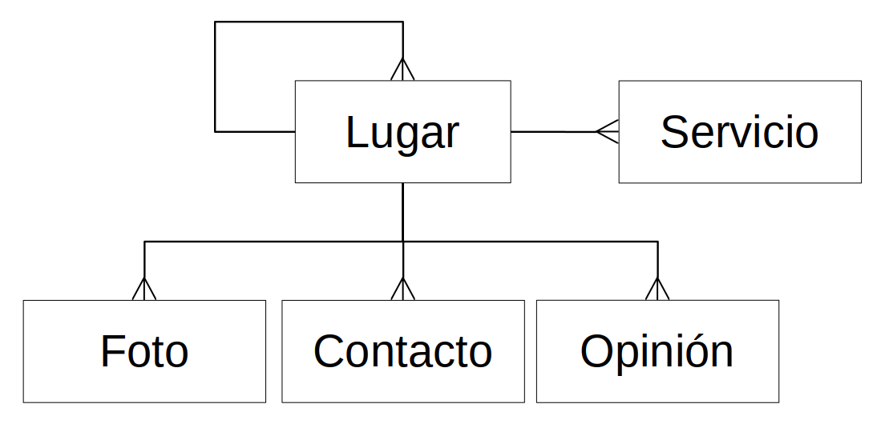

# TouchDCity, plataforma abierta de servicios e información para el ciudadano

Gabriel A. López López 1,
Carlos C. Caballero Diaz 2, Daniel A. Rodríguez Caballero 3

<small>
1 Daxslab, Máster glpz@daxslab.com 
2 Daxslab, Ingeniero ccesar@daxslab.com 
3 Daxslab, Ingeniero daniel@daxslab.com 
</small>

Temática
--------

El desarrollo de aplicaciones y la provisión de servicios basados en Código Abierto.

Resumen
-------

TouchDCity es una plataforma de servicios e información para los ciudadanos. En la misma es posible añadir, buscar y encontrar información referente a las distintas ciudades del país y los lugares que en ellas existen. A los diferentes tipos de lugares se les pueden asociar servicios que brindan funciones añadidas a los usuarios de la plataforma. TouchDCity es una plataforma de código abierto en busca de la transparencia en el proceso de desarrollo así como maximizar las oportunidades de apoyo de la comunidad. En función de lograr el posicionamiento de información nacional en la redes sociales se ha desarrollado un sistema de difusión automática de los datos hacia Twitter y Facebook. TouchDCity fue desarrollado utlizando PHP como lenguaje de programación, MySQL como gestor de base de datos, Yii PHP Framework como marco de trabajo y Leaflet para la construcción y procesamiento de los mapas con datos de OpenStreetMap. El código fuente del proyecto TouchDCity está disponible en https://github.com/daxslab/touchdcity.

**Palabras claves:** TouchDCity, plataforma web, portal ciudadano, 

Abstract
--------

TouchDCity is a service and information platform for citizens. In it it is possible to add, search and find information regarding the different cities of the country and the places that exist in them. The different types of places can be associated with services that provide added functions to the users of the platform. TouchDCity is an open source platform in search of transparency in the development process as well as maximizing opportunities for community support. In order to achieve the positioning of national information in social networks, a system for automatic dissemination of data to Twitter and Facebook has been developed. TouchDCity was developed using PHP as a programming language, MySQL as a database manager, Yii PHP Framework as a framework and Leaflet for the construction and processing of maps with OpenStreetMap data. The TouchDCity project source code is available at https://github.com/daxslab/touchdcity.

**Keywords:** TouchDCity, web platform, citizen portal

Introducción
------------

Existen varias plataformas y servicios de información de mapas con el objetivo de brindar información geográfica sobre distintos lugares del mundo. En el caso de Cuba, entre las personas que utilizan a menudo las tecnologías de informática y las comunicaciones (TIC) para su vida diaria, se ha popularizado el uso de Google Maps y de Maps.me como las herramientas para saber en que lugar están y hacia donde ir.

Sin embargo, esto es menos popular en el caso de querer encontrar lugares concretos (un teatro, restaurant, etc.) y por suspuesto de beneficiarse de los servicios que estos lugares pudieran ofrecer apoyados en las TIC.

TouchDCity ofrece una plataforma de informacion servicios e información relacionada con los distintos lugares que se pueden encontrar en una ciudad. Es una solución de código abierto pensada para el enriquecimiento contínuo gracias a la colaboración de la comunidad en forma de:

- Sugerencias
- Avisos de errores
- Código fuente

Para representar la información en TouchDCity se ha diseñado una estructura jerárquica que permita representar la existencia de los lugares apartándose de los conceptos tradicionales de división político administrativa para evitar las restricciones que se presentan en dicho modelo, y que por tanto, funcione de manera general.

Con este modelo es posible representar como lugar a Cuba, que tendría como “hijos” a las diferentes provincias, cada una tendría como “hijos” a los municipios y estos a su vez ya tienen como “hijos” a los lugares “no geográficos”: los que tienen una categoría de servicio y por tanto pueden ofrecerlo. Para complementar la descripción de un lugar se le pueden agregar fotos y datos de contacto.

Además de la plataforma de web, TouchDCity, ofrece acceso a su base de datos abierta mediante una API Rest, que permite que otros clientes puedan acceder a la información. El cliente oficial de TouchDCity es la aplicación Android del mismo nombre y que está orientada más a la geolocalización de los usuarios y los lugares que están cercanos a él.

Otra funcionalidad implementada en TouchDCity está asociada a la posibilidad de dejar una recomendación (positiva o negativa) sobre cada lugar que aparece en el catálogo lo cual establece un ranking entre los mismos permitiendo a los usuarios escoger a donde ir. Dicha información, además de ser consultable en la plataforma se puede obtener mediante la API creada con este propósito permitiendo, por ejemplo, al sitio web oficial del lugar obtener las opiniones que sobre este se han dejado para mostrarlas así como mostrar un formulario para que nuevos usuarios puedan publicar nuevas. 

Teniendo en cuenta que algunos lugares pueden realizar actividades, se desarrolló el módulo de eventos que permite publicar el calendario de actividades asociando a cada una el nombre, descripción, imagen, fecha y hora de inicio y fin, y un precio opcional. La información de estos calendarios se publica en formato ICAL de forma tal que cualquier dispositivo o aplicación que "entienda" este estándar de distribución de datos, podrá recibir facilmente la información. Por ejemplo, la aplicación Calendario de cualquier dispositivo Android o iOS.

De la misma manera se complementa la información de los lugares con una sección de noticias, utilizando para esto fuentes RSS que se escanean para mostrar los titulares de las publicaciones recientemente echas en los sitios web de los lugares que lo tengan activado, y enlazar al texto completo en la fuente original. De esta forma, no es necesaria la gestión de las noticias de forma local en la aplicación.

Otro beneficio de la organización jerárquica de los lugares, consiste en que cuando se está en un nivel superior, por ejemplo Cienfuegos, es posible acceder a toda la información de los hijos de forma agrupada, o sea un calendario de todos los eventos en Cienfuegos, las opiniones dadas sobre lugares de la ciudad, o las últimas noticias publicadas.

Teniendo en cuenta la importancia de las redes sociales, todos los enlaces a los lugares que se encuentran en el catálogo y las opiniones que se publican sobre los mismos, se difunden automáticamente en las redes sociales Twitter y Facebook, incrementando el alcance de la información. 

TouchDCity soporta varios modelos de negocio a partir de la cantidad de información que es capaz de gestionar. La forma básica de ingresos en la plataforma consiste en el cobro por la inscripción en la misma lo que daría ciertos beneficios al cliente para la gestión del lugar. Otros son los asociados a los servicios a construir una vez que se estabilicen las pasarelas de pago de las plataformas nacionales de comercio electrónico:

- Entradas a galerías, teatros, museos
- Venta de disponibilidad habitacional para casas particulares

Las características de la arquitectura de TouchDCity permiten que pueda ser reutilizado como plataforma de información por otros actores, como pueden ser los gobiernos locales, instituciones, etc. para el desarrollo de proyectos relacionados con la informatización de la sociedad, el gobierno electrónico, turismo, rutas patrimoniales y otros. 

Entre los proyectos que se están contemplando con la Unión de Informáticos de Cuba y el gobierno de Cienfuegos está el colocar pantallas por la ciudad con información obtenida desde la plataforma. 

Materiales y métodos
--------------------

El desarrollo de TouchDCity contempla a Github como plataforma para la gestión del proyecto. 
Al ser un sistema web es necesario tener en cuenta las tecnologías HTML, CSS y Javascript para la presentación de la información del lado del cliente. Dichas tecnologías están estandarizadas por el W3C («World Wide Web Consortium (W3C)», s. f.).

Del lado del servidor se utilizan Yii PHP Framework que permite la construcción rápida de aplicaciones web reutilizando componentes de terceros y facilitando la construcción de los propios gracias a su flexible y extensible arquitectura (Bogdanov & Eliseev, 2016). Para almacenamiento de los datos se utiliza el servidor de bases de datos relacionales MySQL. 

TouchDCity pone en práctica la filosofía de datos abiertos, que persigue que ciertos tipos de  datos estén disponibles de forma libre, sin restricciones de derecho de autor, patentes u otros mecanismos de control (Peset, Aleixandre-Benavent, Blasco-Gil, & Ferrer-Sapena, 2017). Los datos se ponen a disposición de los usuarios para que estos los puedan consumir directamente o construir otras aplicaciones que hagan uso de los mismos. Esto se posible con la implementación de una API REST,  o sea, la arquitectura de software para sistemas hipermedia distribuidos en Internet (Li, Chou, Zhou, & Luo, 2016).

Java y el Android SDK fueron utilizados para la construcción del cliente Android de TouchDCity.

La construcción de los mapas y procesamiento de los datos geograficos se hace mediante la librería Leaflet contra los tiles de mapas proporcionados por el proyecto OpenStreetMap.
Para el posicionamiento de los lugares en el mapa y de los usuarios en el mismo, se utiliza el sistema y tecnologías GPS presente en la mayoría de los dispositivos móviles. Esto permite ubicar locaciones con varios metros de precisión, tiene una cobertura mundial y puede atender a una cantidad ilimitada de usuarios. 

Conclusiones
------------

- TouchDCity es una plataforma que brinda información a los ciudadanos sobre los lugares en su ciudad.
- TouchDCity brinda los componentes esenciales para que se puedan desarrollar servicios relacionados con los lugares listados y en busca de esto se ha liberado el código fuente de la plataforma.
- El acceso a la información es abierto mediante una API REST.
- TouchDCity constituye ejemplo de la posibilidad de desarrollar modelos de negocios sobre la base de tecnologías abiertas.

Referencias
-----------

- Bogdanov, A., & Eliseev, D. (2016). Yii2 Application Development Cookbook. Packt Publishing Ltd.
- Li, L., Chou, W., Zhou, W., & Luo, M. (2016). Design patterns and extensibility of REST API for networking applications. IEEE Transactions on Network and Service Management, 13(1), 154-167.
- Peset, F., Aleixandre-Benavent, R., Blasco-Gil, Y., & - - - Ferrer-Sapena, A. (2017). Datos abiertos de investigación. Camino recorrido y cuestiones pendientes. Anales de documentación, 20. Facultad de Comunicación y Documentación y Servicio de Publicaciones de la ….
- World Wide Web Consortium (W3C). (s. f.). Recuperado 10 de noviembre de 2019, de https://www.w3.org/
